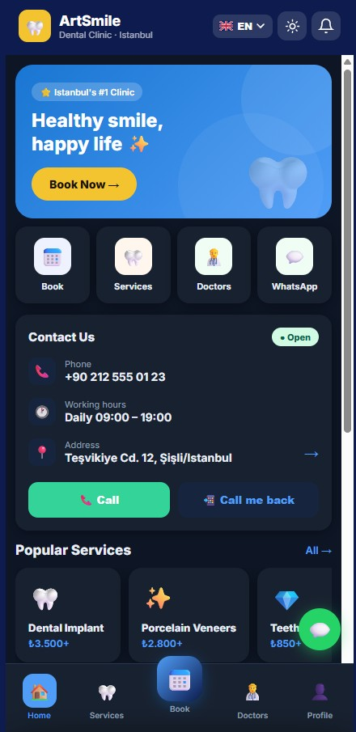

# 🦷 ArtSmile — Dental Clinic Booking Platform

**Live demo: [artsmile-demo.pages.dev](https://artsmile-demo.pages.dev)** — open on your phone and try "Add to Home Screen".



A booking platform for dental clinics: an installable **Progressive Web App** on the
patient side (no app stores — open a link, add to home screen with one tap, use it like
a regular app) backed by a real **Node.js/TypeScript API** on the server side.

Started as a sales demo for cold outreach to Turkish dental clinics (show the result in
30 seconds via a link instead of describing it in words) and grew into a real backend:
a working appointments/patients API replacing the frontend's mocked data — the
foundation for turning a single-clinic demo into a proper SaaS.

## What's inside

- Booking flow: service → doctor → time slot, aware of which doctors offer which service
- Patient profile: personal info, medical record, treatment history with doctor's notes, loyalty program
- Doctor cards: photo, bio, reviews, service list — expand on tap
- One-tap emergency booking for acute pain
- Dark theme (toggle in the header, persisted in localStorage)
- Home screen install: custom flow for iOS Safari (hint banner) and desktop
- Multi-language (built for the Turkish market)
- Service Worker with auto-update (`sw.js`, cache versioning)

## Technical details that usually get skipped in PWA demos

- `position: fixed` for the bottom nav bar, specifically patched for iOS Safari
  (standard `100dvh` "floats" there, had to pin the height via `window.innerHeight` in JS)
- `manifest.webmanifest` with a unique `id` — so Chrome doesn't treat a reinstall as a new app
- Safe-area padding for the iPhone notch / gesture bar

## Stack

**Frontend:** plain **HTML/CSS/JS**, no framework — a deliberate choice, so the demo
weighs almost nothing and opens instantly on slow mobile connections (a common scenario
for a clinic's end clients). Hosted on Cloudflare Pages.

**Backend:** [`backend/`](backend) — a real **Node.js + TypeScript + Express** API
(SQLite via `better-sqlite3`) turning the static demo into an actual multi-clinic SaaS:
appointments and patients endpoints, ready to swap the frontend's mocked data for live
API calls. See [backend/README.md](backend/README.md).

## Running locally

**Frontend only (demo mode, mocked data):**
```bash
npx serve -p 3456 .
```
Or just open `index.html` in a browser — fully static, no backend required.

**With the real backend:**
```bash
cd backend
npm install
npm run dev
```
API runs on `http://localhost:3000`.

## Deployment

See [DEPLOY.md](DEPLOY.md) — Cloudflare Pages, `public/` is built from the source files.
